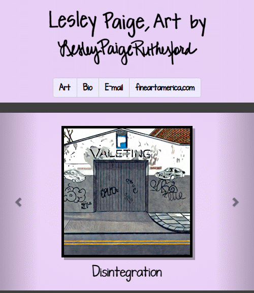

# Lesley Paige Art Website

This project is a dynamic and responsive art website.  The dynamic portion is a MySQL database with all the information needed (title, dimensions, price, etc) to display a piece of art on the site.  It is presented through PHP scripts using the PDO class.  A mobile size version of the site is supplied using Bootstrap, and otherwise sized using CSS.  The styles are also dynamic, using PHP scripts to present CSS files.

There is also a content management system designed as a password protected admin directory.  Through this area, pieces of art can be added, edited, moved around, and hidden or shown.  The PHP  library called imagick (fork of ImageMagick) supplies most of the image editing functions.  The admin area allows the user to fully control the content, including style.  The style section allows the user to change the color scheme and the font stylings, but not the general appearance of the site.  These custom stylings are stored in the database and called upon using PHP files that generate CSS.

## Getting Started

To replicate this project, it must reside on a server with PHP and MySQL/MariaDB installed.  No original artwork is supplied on GitHub.  Replicating the project will also require PHP database credentials files, also not supplied on GitHub.  However, a MySQL dump file (`data.sql`) is provided to re-create the artwork database with  values.  These values are not useful without the associated image files, but they provide a rough idea of what is expected.

### Prerequisites

* Web server such as Apache2 or NGINX, or access to shared hosting
* PHP (v7.3 was used, but this is not necessarily the minimum requirement)
* imagick PHP installation (needed for admin area only)
* MySQL or MariaDB
* MySQL PHP installation

### Installation notes

Server installations will vary from system to system and will not be discussed.  This document assumes that the user has some familiarity with such services.  It should be noted, however, that the imagick library for PHP is not necessarily a standard service on shared hosting, and imagick installation on Windows can be complicated.  Also, if you have control over your `php.ini` file, then you may have to adjust the upload maximum size and the memory limits for the admin area.  If you cannot adjust these, then you may have to reduce the size of an image before uploading it.

### Step-by-step instructions

1. Set up a web server with PHP and MySQL/MariaDB.  Instructions for this will vary by system.
1. Install imagick for PHP on the server, if not already present.  **If your server doesn't have imagick installed, then the admin area of the site will not work.**
1. Modify `php.ini` to increase the upload limit, the max memory allocation, and possibly the timeout limit.  *(Note: You may find that your web service does not allow this, or that you are experiencing problems even after raising these limits.  If this is the case, then your only other option is to reduce the size of an image prior to upload)*
1. Test to make sure that MySQL and imagick are working before proceeding.
1. Clone the [git project](https://github.com/rbrutherford3/Lesley-Paige.git) to a directory that your web service can access.
1. Password protect the admin directory through your server.  (ex: on Apache2, create an `.htaccess` file in the admin folder and configure appropriately)
1. Run the `data.sql` file to set up the database.  *(Note: you may wish to remove the data from `data.sql` and have it simply set up empty tables)*
1. Create two users for MySQL: one for viewing (limited permissions), and one for the admin area (full permissions).  Dividing access between users isn't absolutely necessary, but highly recommended.
1. Store the login information into two separate `credentials.php` files.  Add the credentials file for limited access to the root directory of the site, and the credentials file for full access to the admin directory.
1.  You are all set!  Give it a go.

## High Level Overview

As previously mentioned, there are two main areas of the site: the user section that functions just as a regular dynamic website, and the admin area for content management.  In the following sections, the individual files for each will be explained.

### User area

#### `index.php`

First file visited.  Here, the contents of the database are queried.  There are two display types: mobile (uses a Bootstrap carousel) and a configuration for larger screens.  Bootstrap is used to distinguish the two.  From here, different files are used to present most of the information.

#### `header.php`

Imported file that contains the links to every page of the site.  This code is imported into all portions of the site.

#### `footer.php`

Imported file that closes out the header HTML.  This code is imported into every page of the site.

#### `table-many.php`

Lists out every single published artpiece and their resprective thumbnails, piece titles, and links to further information (`art.php`).  This listing is styled for appearance and imported into `index.php`.

#### `art.php`

Page for a single artpiece.  Contains all the thumbnail, title, and other information such as size, price, availability, etc.  There are also external links for purchase information.

#### `artfull.php`

Page for a larger, watermarked, version of the artpiece.

### Admin Area

Note that some of these PHP files have supporting Javascript files which are not individually discussed.

#### `artpiece.php`

The heart of the admin area, this file contains all the information for an artpiece (location, information, image adjustment settings, etc) and is used to convey this partially formed artpiece to the user.  It basically holds everything in memory that is unsaved.

#### `artpiecefile.php`

Effectively a sub-class of `artpiece.php` that holds the image and other image information and methods.

#### `artpieceinfo.php`

Effectively a sub-class of `artpiece.php` that holds the text information for the artpiece.

#### `admin/index.php`

Simple menu of options.

#### `admin/image.php`

Contains a static libary of image functions, such as adding the watermark to the image.

#### `admin/sequence.php`

Displays each piece of artwork in the database.  The user can change the order of the artwork displayed, and publish/unpublish pieces (unpublished pieces are not shown on the main site).  The user may also add a piece or edit an existing piece.

#### `admin/upload.php`

Upload a new artpiece or a new image file to replace an existing artpiece.

#### `admin/rotate.php`

Rotate an artpiece by clicking on it.  Angle of rotation is saved in the database.

#### `admin/crop.php`

Crop an artpiece down to a smaller size.  Crop margin values are stored in the database.  This allows the process to be replicated and no image data is thrown out unnecessarily.

#### `admin/confirmfiles.php`

Shows the user the resulting thumbnail and watermarked images created by uploading, rotating, and cropping the image.  User must confirm before proceeding.  Proceeding saves the thumbnail and the watermarked image to storage.

#### `admin/editinfo.php`

This page allows the user to add or edit information for the artpiece.  The user also may optionally re-do the rotating and croppping or replace the image entirely.

#### `admin/confirminfo.php`

User must confirm that the entered information is correct before it can be saved to the database.

#### `admin/style.php`

Form for changing the color scheme and the fonts used for the site.  These changes are saved to the database and are called by `css/main.php` and `css/text.php`.  Stylings are saved in case there is a need to revert to an old styling.

#### `admin/bio.php`

Allows the user to edit and save their biography.

**(note that there are a few more files in the admin area not discussed here, please see comments in the individual files for a better understanding of what they do)**

### Supporting Files

#### `paths.php`

Supplies global variables, such as directory strings, dimensions, and other settings.  The paths supplied are in both PHP format and HTML format.

#### `database.php`

Contains the information for establishing a database connection by supplying a PDO object.  One for the main site (limited access) and another for the admin area (full access).

#### `credentials.php`

Contains MySQL login information as PHP constants (files not supplied).  One for the main site (limited access) and another for the admin area (full access).

#### `hsl2rgb.php`

Converts the typical hexadecimal RGB representation of an image into the less common but more practical hue, saturation, and value.  It is used by `admin/style.php` and `css/main.php` to manipulate the color scheme in a clearer fashion.

#### `css/main.php`

Provides general styling rules as well as a dynamic color scheme.  Note that this file is only used in the user area.

#### `css/text.php`

Provides general styling rules as well as a dynamic color scheme.  Note that this file is only used in the user area.

#### `fonts/Lesley...`

Custom font stylings, manually prepared by the artist to convey her own handwriting.  Note that this file is only used in the user area.

#### `img/`

Contains a couple files for the main site (artist photo and favicon), as well as image files in various form (watermarked, thumbnail, etc).  Note that all files for the same piece must have the same base filename.  These image files are not available on GitHub.

## Running tests

The best way to test the site is simply to view it and click through the artpieces and menu options to determine that they behave as expected.

### Example tests

To test the admin area, however, one should:

* Attempt to upload a new piece of artwork and:
	1. Rotate it
	1. Crop it
	1. Supply the information for the piece
	1. Publish it
	1. View the piece on the main site and make sure everything looks as expected
* Modify an existing piece of art, doing the same as above
* Adjust the order of the published pieces and check them on the main site
* Adjust the styling, changing all the colors and the fonts, saving, checking the results on the main site
* Revert back to a previous style and make sure the results appear on the main site
* Change the biography and make sure the changes appear on the main site

## Deployment

[lesleypaigeart.com](https://lesleypaigeart.com/), using [Hostinger](https://www.hostinger.com/) shared web hosting

## Built With

LAMP (Linux, Apache2, MySQL, and PHP)

Written mostly using `nano`, a word processor for Linux

Note that the L and A parts of the LAMP stack are not set in stone (one could use Windows instead of Linux or NGINX instead of Apache).  Before desigining the admin portion on Linux, WAMP, AMPPS, and then XAMPP were all used for testing and Notepad++ was used for writing the code.

## Contributing

Please contact me (robbie9485 on GitHub) in order to inquire more about the project.

## Versioning

`Git` command line saved to *GitHub*

## Authors

Robert Rutherford

## License

This project is licensed under the MIT License - see the [LICENSE](../LICENSE) file for details

## Acknowledgments

* Thanks to Lesley, for being patient with me as I built this, and for supplying the computer to do so.
* Thanks to Victor Semenov and Lukas Svrcek for helping me out with tips when I needed it.
* Thanks to Starbucks for not kicking me out when I stayed there for a few hours working on it.
